# Module dependency graph

Generated by `make graph` (`scripts/dep-graph.nix`) from the current state of `flake.nix`, `modules/`, `users/`, `darwin/`, and `overlays/`. Do not hand-edit; rerun `make graph` instead.

Roots are flake inputs. Leaves are modules with no further local `imports`. Two things this graph deliberately omits (see `scripts/dep-graph.nix` for why): `config.dotfiles.*` option-read couplings between modules, and which specific flake input feeds a non-path `imports` entry (collapsed into the single `external module (via inputs)` node).

```mermaid
flowchart LR
subgraph "External"
    n_external_module__via_inputs_["external module (via inputs)"]
end
subgraph "Flake Inputs"
    n_clan_core["clan-core"]
    n_devctl["devctl"]
    n_direnv_instant["direnv-instant"]
    n_flake_parts["flake-parts"]
    n_flake_utils["flake-utils"]
    n_gomod2nix["gomod2nix"]
    n_home_manager["home-manager"]
    n_hosts["hosts"]
    n_mangopkgs["mangopkgs"]
    n_mynix["mynix"]
    n_nil["nil"]
    n_nix_darwin["nix-darwin"]
    n_nix_direnv["nix-direnv"]
    n_nix_init["nix-init"]
    n_nix_vscode_extensions["nix-vscode-extensions"]
    n_nixd["nixd"]
    n_nixpkgs["nixpkgs"]
    n_nixvim["nixvim"]
    n_sops_nix["sops-nix"]
    n_stylix["stylix"]
    n_systems["systems"]
    n_treefmt_nix["treefmt-nix"]
    n_ux["ux"]
    n_zed["zed"]
end
subgraph "darwin"
    n_darwin_erasmussen["darwin/erasmussen"]
end
subgraph "flake.nix wiring"
    n_Eriks_MacBook_Pro["Eriks-MacBook-Pro"]
    n_erasmussen_Eriks_MacBook_Pro["erasmussen@Eriks-MacBook-Pro"]
    n_erik_hades["erik-hades"]
    n_erik_darter["erik@darter"]
    n_erik_server["erik@server"]
    n_overlay__flake_nix__composed_["overlay (flake.nix, composed)"]
end
subgraph "modules"
    n_modules["modules"]
end
subgraph "modules/ai"
    n_modules_ai["modules/ai"]
    n_modules_ai__collapsed_["31 leaf modules"]
end
subgraph "modules/automation"
    n_modules_automation["modules/automation"]
    n_modules_automation_flake_update["modules/automation/flake-update"]
end
subgraph "modules/browsers"
    n_modules_browsers["modules/browsers"]
end
subgraph "modules/editors"
    n_modules_editors["modules/editors"]
    n_modules_editors_emacs["modules/editors/emacs"]
    n_modules_editors_helix["modules/editors/helix"]
    n_modules_editors_neovim["modules/editors/neovim"]
    n_modules_editors_obsidian["modules/editors/obsidian"]
    n_modules_editors_vscode["modules/editors/vscode"]
    n_modules_editors_zed["modules/editors/zed"]
end
subgraph "modules/fonts"
    n_modules_fonts["modules/fonts"]
end
subgraph "modules/gnupg"
    n_modules_gnupg["modules/gnupg"]
end
subgraph "modules/shells"
    n_modules_shells["modules/shells"]
    n_modules_shells_zsh["modules/shells/zsh"]
    n_modules_shells_zsh_oh_my_zsh["modules/shells/zsh/oh-my-zsh"]
end
subgraph "modules/sops"
    n_modules_sops["modules/sops"]
end
subgraph "modules/ssh"
    n_modules_ssh["modules/ssh"]
end
subgraph "modules/stylix"
    n_modules_stylix["modules/stylix"]
end
subgraph "modules/terminals"
    n_modules_terminals["modules/terminals"]
    n_modules_terminals_ghostty["modules/terminals/ghostty"]
    n_modules_terminals_kitty["modules/terminals/kitty"]
end
subgraph "modules/toolchain"
    n_modules_toolchain["modules/toolchain"]
    n_modules_toolchain__collapsed_["9 leaf modules"]
    n_modules_toolchain_git["modules/toolchain/git"]
    n_modules_toolchain_git_opencommit_nix["modules/toolchain/git/opencommit.nix"]
    n_modules_toolchain_git_repos_nix["modules/toolchain/git/repos.nix"]
end
subgraph "modules/toolchain/kubernetes"
    n_modules_toolchain_kubernetes["modules/toolchain/kubernetes"]
    n_modules_toolchain_kubernetes_k9s["modules/toolchain/kubernetes/k9s"]
    n_modules_toolchain_kubernetes_openshift["modules/toolchain/kubernetes/openshift"]
    n_modules_toolchain_kubernetes_rosequartz["modules/toolchain/kubernetes/rosequartz"]
end
subgraph "overlays"
    n_overlays_clan_nix["overlays/clan.nix"]
end
subgraph "users/erasmussen"
    n_users_erasmussen["users/erasmussen"]
    n_users_erasmussen_eriks_macbook_pro_nix["users/erasmussen/eriks-macbook-pro.nix"]
    n_users_erasmussen_vscode_eriks_macbook_pro_nix["users/erasmussen/vscode/eriks-macbook-pro.nix"]
end
subgraph "users/erik"
    n_users_erik["users/erik"]
    n_users_erik_darter_nix["users/erik/darter.nix"]
    n_users_erik_desktop_nix["users/erik/desktop.nix"]
    n_users_erik_hades_nix["users/erik/hades.nix"]
    n_users_erik_server_nix["users/erik/server.nix"]
    n_users_erik_vscode_hades_nix["users/erik/vscode/hades.nix"]
end
subgraph "users/shared"
    n_users_shared["users/shared"]
    n_users_shared_git_nix["users/shared/git.nix"]
    n_users_shared_k9s_nix["users/shared/k9s.nix"]
    n_users_shared_kitty_nix["users/shared/kitty.nix"]
    n_users_shared_neovim_nix["users/shared/neovim.nix"]
    n_users_shared_vscode_nix["users/shared/vscode.nix"]
    n_users_shared_zed_nix["users/shared/zed.nix"]
    n_users_shared_zsh_prezto_nix["users/shared/zsh/prezto.nix"]
end
  n_nixpkgs --> n_overlay__flake_nix__composed_
  n_devctl --> n_overlay__flake_nix__composed_
  n_mangopkgs --> n_overlay__flake_nix__composed_
  n_nil --> n_overlay__flake_nix__composed_
  n_nix_direnv --> n_overlay__flake_nix__composed_
  n_nix_vscode_extensions --> n_overlay__flake_nix__composed_
  n_overlays_clan_nix --> n_overlay__flake_nix__composed_
  n_clan_core --> n_overlays_clan_nix
  n_home_manager --> n_erasmussen_Eriks_MacBook_Pro
  n_home_manager --> n_erik_hades
  n_home_manager --> n_erik_darter
  n_home_manager --> n_erik_server
  n_erasmussen_Eriks_MacBook_Pro --> n_users_erasmussen
  n_erik_hades --> n_users_erik
  n_erik_darter --> n_users_erik
  n_erik_server --> n_users_erik_server_nix
  n_hosts --> n_erasmussen_Eriks_MacBook_Pro
  n_hosts --> n_erik_hades
  n_hosts --> n_erik_darter
  n_hosts --> n_erik_server
  n_stylix --> n_erik_darter
  n_stylix --> n_erik_hades
  n_stylix --> n_erasmussen_Eriks_MacBook_Pro
  n_overlay__flake_nix__composed_ --> n_erasmussen_Eriks_MacBook_Pro
  n_overlay__flake_nix__composed_ --> n_erik_hades
  n_overlay__flake_nix__composed_ --> n_erik_darter
  n_overlay__flake_nix__composed_ --> n_erik_server
  n_nix_darwin --> n_Eriks_MacBook_Pro
  n_Eriks_MacBook_Pro --> n_darwin_erasmussen
  n_home_manager --> n_Eriks_MacBook_Pro
  n_Eriks_MacBook_Pro --> n_users_erasmussen
  n_hosts --> n_Eriks_MacBook_Pro
  n_stylix --> n_Eriks_MacBook_Pro
  n_overlay__flake_nix__composed_ --> n_Eriks_MacBook_Pro
  n_modules --> n_modules_ai
  n_modules --> n_modules_automation
  n_modules_automation --> n_modules_automation_flake_update
  n_modules --> n_modules_browsers
  n_modules --> n_modules_editors
  n_modules_editors --> n_modules_editors_emacs
  n_modules_editors --> n_modules_editors_helix
  n_modules_editors --> n_modules_editors_neovim
  n_modules_editors_neovim --> n_external_module__via_inputs_
  n_modules_editors --> n_modules_editors_obsidian
  n_modules_editors --> n_modules_editors_vscode
  n_modules_editors --> n_modules_editors_zed
  n_modules --> n_modules_fonts
  n_modules --> n_modules_gnupg
  n_modules --> n_modules_shells
  n_modules_shells --> n_modules_shells_zsh
  n_modules_shells_zsh --> n_modules_shells_zsh_oh_my_zsh
  n_modules --> n_modules_sops
  n_modules_sops --> n_external_module__via_inputs_
  n_modules --> n_modules_ssh
  n_modules --> n_modules_stylix
  n_modules --> n_modules_terminals
  n_modules_terminals --> n_modules_terminals_ghostty
  n_modules_terminals --> n_modules_terminals_kitty
  n_modules --> n_modules_toolchain
  n_modules_toolchain --> n_modules_toolchain_git
  n_modules_toolchain_git --> n_modules_toolchain_git_repos_nix
  n_modules_toolchain_git --> n_modules_toolchain_git_opencommit_nix
  n_modules_toolchain --> n_modules_toolchain_kubernetes
  n_modules_toolchain_kubernetes --> n_modules_toolchain_kubernetes_k9s
  n_modules_toolchain_kubernetes --> n_modules_toolchain_kubernetes_openshift
  n_modules_toolchain_kubernetes --> n_modules_toolchain_kubernetes_rosequartz
  n_users_erik --> n_modules
  n_users_erik --> n_users_shared
  n_users_shared --> n_users_shared_git_nix
  n_users_shared --> n_users_shared_neovim_nix
  n_users_shared --> n_users_shared_kitty_nix
  n_users_shared --> n_users_shared_zed_nix
  n_users_shared --> n_users_shared_vscode_nix
  n_users_shared --> n_users_shared_k9s_nix
  n_users_shared --> n_users_shared_zsh_prezto_nix
  n_users_erik --> n_users_erik_darter_nix
  n_users_erik --> n_users_erik_hades_nix
  n_users_erik_hades_nix --> n_users_erik_desktop_nix
  n_users_erik_hades_nix --> n_users_erik_vscode_hades_nix
  n_users_erik_server_nix --> n_modules_gnupg
  n_users_erik_server_nix --> n_modules_shells
  n_users_erik_server_nix --> n_modules_sops
  n_users_erik_server_nix --> n_modules_ssh
  n_users_erik_server_nix --> n_modules_toolchain
  n_users_erasmussen --> n_modules
  n_users_erasmussen --> n_users_shared
  n_users_erasmussen --> n_users_erasmussen_eriks_macbook_pro_nix
  n_users_erasmussen_eriks_macbook_pro_nix --> n_users_erasmussen_vscode_eriks_macbook_pro_nix
  n_modules_ai --> n_modules_ai__collapsed_
  n_modules_toolchain --> n_modules_toolchain__collapsed_

```

Parents fanning out to more than 8 leaf modules are collapsed to one summary node above; full lists:

- `modules/ai` (31): `modules/ai/adhd.nix`, `modules/ai/aws.nix`, `modules/ai/azure.nix`, `modules/ai/brave-search.nix`, `modules/ai/caveman.nix`, `modules/ai/chrome-devtools.nix`, `modules/ai/cloudflare.nix`, `modules/ai/containers.nix`, `modules/ai/context7.nix`, `modules/ai/csharp.nix`, `modules/ai/deepwiki.nix`, `modules/ai/figma.nix`, `modules/ai/fsharp.nix`, `modules/ai/gh-stack.nix`, `modules/ai/git-mcp.nix`, `modules/ai/go.nix`, `modules/ai/gossamer.nix`, `modules/ai/haskell.nix`, `modules/ai/kubernetes.nix`, `modules/ai/moer.nix`, `modules/ai/nix.nix`, `modules/ai/notion.nix`, `modules/ai/ocaml.nix`, `modules/ai/omnigent.nix`, `modules/ai/opencode.nix`, `modules/ai/playwright.nix`, `modules/ai/rust.nix`, `modules/ai/slack.nix`, `modules/ai/tdd-orchestrator.nix`, `modules/ai/terraform.nix`, `modules/ai/typescript.nix`
- `modules/toolchain` (9): `modules/toolchain/c`, `modules/toolchain/containers`, `modules/toolchain/dotnet`, `modules/toolchain/go`, `modules/toolchain/javascript`, `modules/toolchain/nix`, `modules/toolchain/ocaml`, `modules/toolchain/python`, `modules/toolchain/rust`
